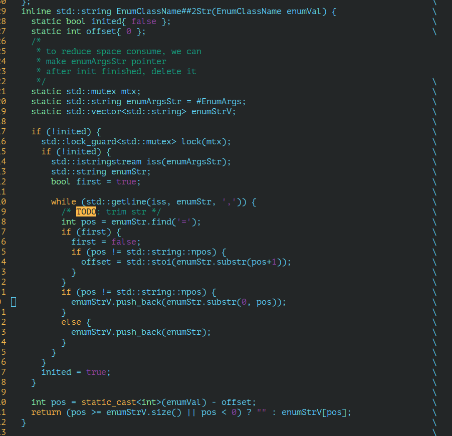
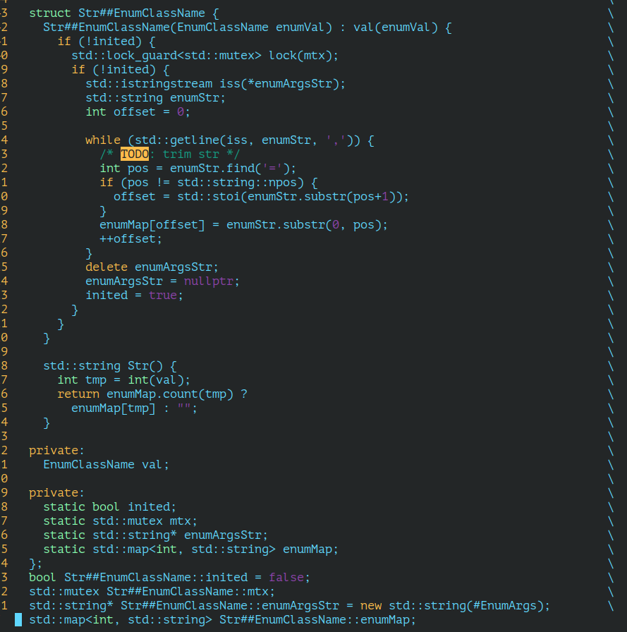

# 缘起

在打日志的时候， 如果直接打印枚举值， 那么最终日志里面只会存在意义不明的整数。为了使枚举类型在日志中的意义更加明确， 我们需要自定义

枚举值转字符串的方法。通常我们会使用一个map来对枚举值和其字符串做一个映射。

这么做固然是正确的，但是为每个枚举类型都写一个字符串转换函数也太累了吧？

为此， 我实现了一个枚举定义宏， 这个宏可以自动生成一个枚举类型及其字符串转换函数。

# 实现

实现方式借助了可变长参数这一特性。本想着能否直接获取到可变长参数的token， 但是上网查了一圈都没发现可行之处。所以最终只好把可变长参数先转换

成字符串， 然后解析这个字符串获取到枚举的字符串形式。

这种方式的缺点是浪费了一个argStr内存来保存可变长参数字符串以及枚举值只能按照默认的0, 1, 2, 3, 4....来定义

要想指定枚举的值也可以实现， 只需在StrEnumName中做一些额外的解析即可。并且此时枚举的定义变为

DEFINE_ENUM(Test, a=501, b=502, c=503, d, foo, bar);

# 续

仔细想想， 以上的实现并没有保证线程安全， 以下给出线程安全的两种版本。 

# 注

1. 以上实现的两个版本在使用枚举定义宏的时候只允许使用数值字面量， 不允许使用常量或宏定义的文本

2. 第一个版本的枚举值只允许循序定义， 并且只允许给第一个枚举赋值。即只允许DEFINE_ENUMS(a,b,c)或DEFINE_ENUMS(a=200,b,c)两种形式

3. 第二个版本的枚举值定义可以不连续，即DEFINE_ENUMS(a=100， b, c=300)。但不允许枚举中有相同的枚举值， 即DEFINE_ENUMS(a=100, b=200，c=100)是不允许的。

   

# 其他

1. https://stackoverflow.com/questions/185624/static-variables-in-an-inlined-function
2. https://en.cppreference.com/w/c/variadic/va_arg

# 终
